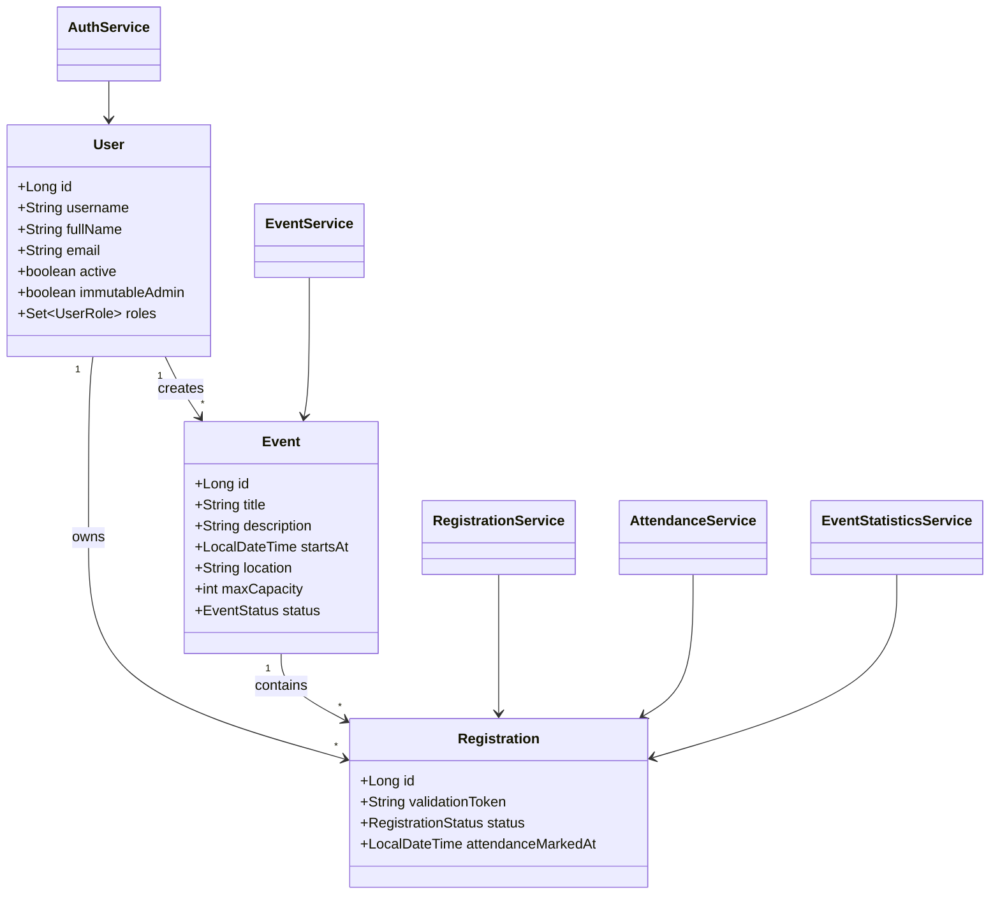

# Diagrama de clases del backend

```mermaid
classDiagram
    class User {
        +Long id
        +String username
        +String fullName
        +String email
        +boolean active
        +boolean immutableAdmin
        +Set~UserRole~ roles
    }

    class Event {
        +Long id
        +String title
        +String description
        +LocalDateTime startsAt
        +String location
        +int maxCapacity
        +EventStatus status
    }

    class Registration {
        +Long id
        +String validationToken
        +RegistrationStatus status
        +LocalDateTime attendanceMarkedAt
    }

    class AuthService
    class EventService
    class RegistrationService
    class AttendanceService
    class EventStatisticsService

    User "1" --> "*" Event : creates
    User "1" --> "*" Registration : owns
    Event "1" --> "*" Registration : contains
    AuthService --> User
    EventService --> Event
    RegistrationService --> Registration
    AttendanceService --> Registration
    EventStatisticsService --> Registration
```
